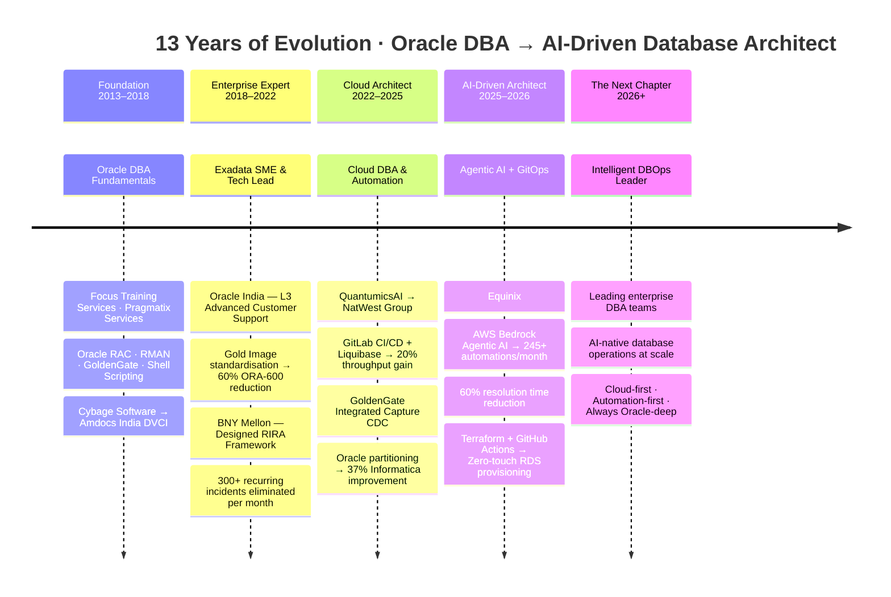

# Sagar V Thosar

### Lead Database Architect & Automation Engineer

*13 years turning enterprise Oracle complexity into intelligent, automated database operations*

---

*Oracle Exadata · AWS Bedrock · Terraform · GitOps · Intelligent DBOps*

**🟢 Open to senior DBA leadership and Cloud Database Architect roles — Immediately Available**

---

## 🚀 The Journey — From DBA to AI-Native Database Architect

---

## 🧠 What I Do

I am a **Senior Oracle DBA who builds the automation systems that make DBA teams operate at a different level.**

Most database teams spend 80% of their time firefighting — blocking sessions, patch failures, manual provisioning, release bottlenecks. I spend mine eliminating those bottlenecks permanently.

My approach: bring **CI/CD thinking, agentic AI, and intelligent automation INTO the DBA practice** — freeing engineers to do architecture-level work instead of routine operations.

---

## 🏆 Proof Points

| Achievement | Impact | Organisation |
|---|---|---|
| AWS Bedrock Agentic AI for DDL/DML/User Management | 245+ interventions automated monthly · 60% faster resolution | Equinix |
| Terraform + GitHub Actions RDS Provisioning Pipeline | Zero DBA involvement after git push | Equinix |
| GitLab CI/CD + Liquibase Oracle Release Pipeline | 20% throughput improvement | NatWest Group |
| RIRA Incident Reduction Framework | 300+ recurring tickets eliminated per month | BNY Mellon |
| Gold Image Patch Standardisation | 60% reduction in ORA-600 incidents | Oracle India |
| Oracle Interval + Reference Partitioning Re-architecture | 37% Informatica workflow improvement | QuantumicsAI |

---

## 🛠️ Technology Stack

**Oracle Core**

**Cloud & AWS**

**Infrastructure as Code & DevOps**

**Languages & Scripting**

**PostgreSQL**

---

## 📂 Featured Repositories

### 🔶 [oracle-rds-terraform](https://github.com/SagarDBA/oracle-rds-terraform)
> **Self-service Oracle RDS provisioning on AWS — GitOps pipeline with Terraform + GitHub Actions**

Application teams provision Oracle databases via a single git commit. Zero DBA involvement from request to running instance. Full PR-gated Terraform plan review before apply. OIDC authentication — no stored AWS keys.

`Terraform` `GitHub Actions` `AWS RDS Oracle` `GitOps` `Infrastructure as Code` `OIDC`

---

### 🐘 [AWS_Claude_Automation](https://github.com/SagarDBA/AWS_Claude_Automation)
> **Self-service PostgreSQL RDS provisioning — Verified live pipeline with proof of execution**

Same GitOps pattern applied to PostgreSQL 16 on AWS RDS. Pipeline completed in **7 minutes 48 seconds** — verified with real AWS output and screenshots in the `proof/` folder. DynamoDB state locking included.

`Terraform` `GitHub Actions` `AWS RDS PostgreSQL` `GitOps` `Verified Live Run`

---

## 🎖️ Certifications

| Certification | Issuer | Year |
|---|---|---|
| ☁️ AWS Certified Cloud Practitioner | Amazon Web Services | 2025 |
| 🔶 Oracle Exadata Database Machine & Cloud Service Implementation Specialist | Oracle | 2021 |
| 🔶 Oracle Cloud Infrastructure (OCI) Implementation Specialist | Oracle | 2021 |
| 🔶 Oracle Certified Professional — Database 12c | Oracle | 2019 |

---

## 📊 GitHub Stats

---

## 🤝 Open to Opportunities

I am currently available for:

- 🏛️ **Lead DBA / Principal Database Architect** — leading enterprise Oracle estates
- ☁️ **Cloud Database Engineer / Cloud DBA** — Oracle + AWS hybrid environments
- 🤖 **Database Reliability Engineer (DBRE)** — automation-first database operations
- 📍 Remote · Hybrid · On-site — India and globally

---

*"Most Oracle DBA teams spend 80% of their time firefighting.*
*I build the systems that make sure they never have to."*

